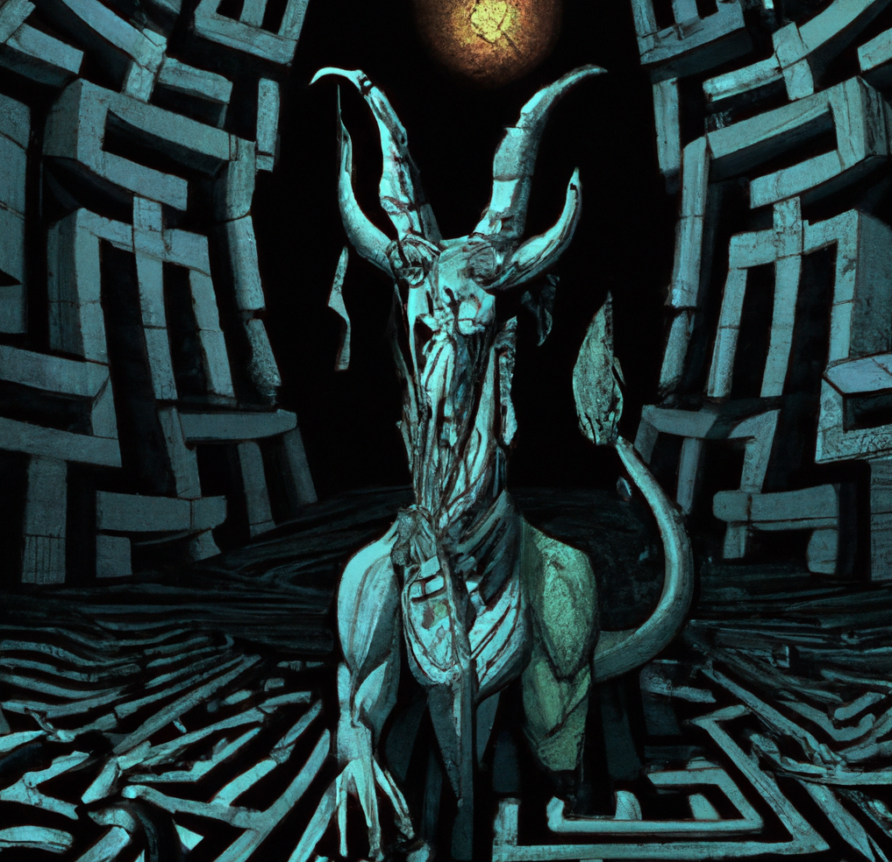

# Assignment 5 & 6 – Minotaur Labyrinth

## Value (%)
Each task is worth 10% of your course grade for a total 20%.

## Story
In a world shrouded in darkness, a brave hero embarks on a treacherous journey into the heart of an ancient labyrinth, a place known to consume the souls of all who dare to enter. The labyrinth, an ominous construct of an era long forgotten, is home to creatures that lurk in every corner, hungry for the taste of human flesh. The darkness within is pierced only by the faintest of light, and the air is thick with the scent of fear and the echoes of long-lost souls.

At the heart of this sinister maze lies a weapon of immeasurable power, the fabled magic sword, capable of slaying the most fearsome of beasts. Yet, the hero is not alone in their quest. A malevolent Minotaur roams the twisted passages, its roar striking fear into the hearts of even the bravest warriors. To emerge victorious, the hero must rely on their senses and wits, navigating the darkness, eluding the monsters, and seizing the magic sword before making their escape to the world outside.

## Task 1 - Room
As a student delving into the depths of the Minotaur's Labyrinth, your first task is to harness your creativity and design a room to challenge and engage the hero. Drawing inspiration from the treacherous Pit Room, dare to conjure a new chamber of perils, one that will test the hero's resolve and cunning as they traverse the dark corridors of the labyrinth.

## How to Complete This Assessment
To accomplish this feat, follow these steps:

1. **Imagine and conceptualize**: Envision the mechanics, characteristics, and atmosphere of your new room. What dangers and surprises does it hold for the hero?

2. **Create a new `RoomType` enumeration**: Establish a distinct identity for your room by adding a new `RoomType` enumeration, ensuring it stands apart from the existing room types.

3. **Develop a new class**: Forge your room's foundation by creating a new class that inherits from the `Room` base class. Implement the necessary properties, methods, and behavior to breathe life into your creation.

4. **Modify the `ProceduralGenerator`**: Weave your room into the fabric of the labyrinth by updating the `ProceduralGenerator` to randomly place your room within the generated map, seamlessly integrating it into the game world.

5. **Update the game logic**: Adapt the game's inner workings to accommodate any unique interactions, encounters, or events that may transpire within your room, ensuring a harmonious coexistence with the existing labyrinth.

6. **Test and iterate on your design**: Hone your creation by testing and refining the player's experience within your room. Ensure it complements the labyrinth's intricate tapestry, adding depth and wonder to the hero's journey.

## How to Submit Your Assessment
Submit a link to the GitHub repo containing your code and provide a summary description of your Room in the Moodle comments box.

## Task 2 - Monster
In the depths of the labyrinth, not only does the hero need to navigate through the treacherous rooms, but they must also confront an array of monstrous creatures that lurk in the darkness. As the labyrinth evolves, so do the monsters that inhabit it. Now, it is your task to breathe life into a terrifying new monster, one that will strike fear into the heart of any hero who dares to enter its domain.

Unleash your creativity and imagine the most fearsome beast. Will it possess supernatural abilities, such as teleportation or the ability to move towards an intruder? Perhaps it will attack the hero with razor sharp claws.

## How to Complete This Assessment
To create a monster of your own design, follow these steps:

1. **Create a new class**: Start by creating a new class for your monster. It should inherit from the `Monster` base class to ensure that it has all the necessary attributes and methods.
2. **Define the monster's attributes**: Give your monster unique attributes such as health points, attack strength, and speed. These attributes will help determine the monster's behavior and how dangerous it is to the hero.
3. **Implement unique abilities**: Consider implementing special abilities or characteristics for your monster. This could include movement patterns, the ability to cast spells, or the power to summon other creatures.
4. **Add the monster to the game**: Integrate your new monster into the game by placing it in one or more rooms. You can do this by modifying the `InitializeMonsters` method in the `LabyrinthCreator` class.
5. **Create tests**: Write tests to ensure that your monster behaves as expected and that its unique abilities function correctly.
6. **Adjust game balance**: Once your monster is implemented, you may need to adjust the game balance to account for the increased difficulty. This could involve modifying the hero's attributes or changing the layout of the labyrinth.

## How to Submit Your Assessment
Submit a link to the GitHub repo containing your code and provide a summary description of your Monster in the Moodle comments box.

# Grading Rubric

## Results (70%)

| Points | Description                                                                                   |
|:------:|-----------------------------------------------------------------------------------------------|
|   7    | Excellent: Highly creative and well-designed room/monster, thorough test coverage including edge cases; all tests pass. |
|   6    | Good: Creative room/monster design, comprehensive test coverage with some edge cases; majority of tests pass. |
|   5    | Satisfactory: Some creativity in room/monster design, adequate test coverage; more than half of tests pass. |
|   3    | Needs Improvement: Limited creativity in room/monster design, limited test coverage; less than half of tests pass. |
|   1    | Poor: Minimal creativity in room/monster design, no tests or minimal tests; none of the tests pass. |
|   0    | Code does not build in the CI workflow.                                                      |
                                                    |

## Class/Method/Variable Naming (10%)

| Points | Description                                                                                   |
|:------:|-----------------------------------------------------------------------------------------------|
|   1    | Excellent: Consistent, meaningful, and clear naming conventions for all classes, methods, and variables. |
|  0.75  | Good: Mostly consistent and meaningful naming conventions; minor inconsistencies or unclear names. |
|  0.5   | Needs Improvement: Inconsistent naming conventions; some unclear or confusing names.          |
|   0    | Poor: No clear naming conventions; many unclear or confusing names.                           |

## Comments/Documentation (10%)

| Points | Description                                                                                   |
|:------:|-----------------------------------------------------------------------------------------------|
|   1    | Excellent: Comprehensive comments and documentation; easy to understand the purpose and functionality of code. |
|  0.5   | Needs Improvement: Some comments and documentation, but lacking clarity or detail in certain areas. |
|   0    | Poor: No comments or documentation; difficult to understand the purpose and functionality of the code. |

## Formatting (10%)

| Points | Description                                                                                   |
|:------:|-----------------------------------------------------------------------------------------------|
|   1    | No formatting is required during the formatting workflow.                                     |
|  0.25  | Minimal formatting is required during the formatting workflow.                                |
|   0    | Extensive formatting is required during the formatting workflow.                              |

